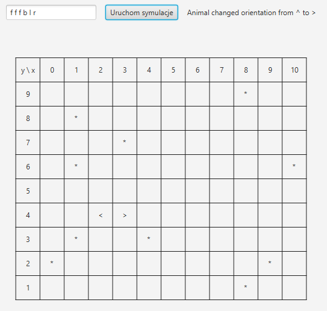

# 🦁🌿 Symulacja Świata - Java 🗺️

## 🌍 Opis Projektu

Projekt to symulacja świata, w której zwierzęta 🦊🐻 poruszają się po mapie według określonych reguł. Środowisko zawiera również trawę 🌱 jako element interaktywny. Kod został napisany w języku Java ☕ i wykorzystuje wzorce projektowe oraz zasady programowania obiektowego. Aplikacja posiada zarówno interfejs graficzny 🎨 (GUI), jak i możliwość działania w trybie konsolowym 🖥️.

## 📂 Struktura Kodu

### 🏗️ Główne komponenty:

- **🧩 Model:**
  - `AbstractWorldMap.java` - Klasa abstrakcyjna definiująca ogólne zasady działania mapy.
  - `Animal.java` - Klasa reprezentująca zwierzęta 🐾, ich pozycję i orientację.
  - `Boundary.java` - Klasa reprezentująca granice mapy.
  - `Grass.java` - Klasa reprezentująca trawę 🌾 na mapie.
  - `GrassField.java` - Implementacja mapy zawierającej trawę.
  - `RectangularMap.java` - Implementacja mapy o określonych wymiarach.
  - `Vector2d.java` - Klasa reprezentująca współrzędne na mapie.
  - `WorldElement.java` - Interfejs reprezentujący elementy świata.
- **🎛️ Kontrolery i interakcja:**
  - `ConsoleMapDisplay.java` - Konsolowy interfejs do wyświetlania zmian na mapie.
  - `MapChangeListener.java` - Interfejs do obsługi powiadomień o zmianach na mapie.
  - `MoveValidator.java` - Interfejs sprawdzający możliwość ruchu zwierzęcia.
  - `WorldMap.java` - Interfejs dla mapy świata 🗺️.
  - `OptionsParser.java` - Klasa do parsowania ruchów zwierząt.
  - `Simulation.java` - Klasa symulująca ruch zwierząt na mapie 🏃‍♂️.
  - `SimulationEngine.java` - Silnik obsługujący wielowątkowe wykonywanie symulacji ⚙️.
  - `World.java` - Główna klasa aplikacji w trybie konsolowym.
  - `SimulationApp.java` - Główna klasa aplikacji w trybie graficznym (GUI) 🎨.
  - `WorldGUI.java` - Uruchamia aplikację w trybie GUI.
- **🧪 Testy jednostkowe:**
  - `AnimalTest.java`
  - `GrassFieldTest.java`
  - `MapDirectionTest.java`
  - `OptionParserTest.java`
  - `RectangularMapTest.java`
  - `Vector2dTest.java`

## 🛠️ Instalacja i Uruchomienie

### 📌 Wymagania

- Java 11 lub nowsza ☕
- Biblioteka **JavaFX** 🎨 (wymagana do uruchomienia wersji GUI)

### 📥 Kroki instalacji

1. Sklonuj repozytorium:
   ```bash
   git clone https://github.com/Redor144/PO_2023_PON1820_BIENIASZ.git
   cd PO_2023_PON1820_BIENIASZ
   ```
2. Skompiluj projekt:
   ```bash
   javac -d out -sourcepath src src/agh/ics/oop/model/*.java
   ```
3. Uruchom aplikację w trybie konsolowym:
   ```bash
   java -cp out agh.ics.oop.World
   ```
4. Uruchom aplikację w trybie graficznym 🎨:
   ```bash
   java -cp out --module-path /ścieżka/do/javafx/lib --add-modules javafx.controls,javafx.fxml agh.ics.oop.WorldGUI
   ```
   W interfejsie graficznym polecenia dla zwierząt wprowadza się w polu tekstowym, używając symboli:
   - `f` ruch do przodu
   - `b` ruch do tyłu
   - `l` obrót w lewo
   - `r` obrót w prawo
   Następnie należy kliknąć **Uruchom symulację**, aby rozpocząć symulację.

## ⚙️ Założenia Działania

- 🦊 Zwierzęta mogą poruszać się w czterech kierunkach: do przodu, do tyłu oraz obracać się w lewo lub prawo.
- 🌿 Mapa przechowuje zarówno zwierzęta, jak i trawę, które wpływają na symulację.
- 🔔 Istnieje mechanizm obserwatora, który powiadamia o zmianach na mapie.
- ⚡ Aplikacja może działać w trybie wielu równoczesnych symulacji dzięki silnikowi wielowątkowemu.

## 📝 Przykładowe Użycie

### 🖥️ Przykładowe użycie w konsoli:

```
Update no: 39999
Message Animal placed on (2,2)
Map ID: 0abfb352-cf50-4042-ae08-0166cd5ff913
 y\x  1 2 3 4 5 6 7 8 9
 11: -------------------
 10: | | | | | | |*| | |
  9: |*|*| |*| |*| | |*|
  8: | | | | | | | | | |
  7: | | | | | | | |*| |
  6: |*| | | | | | | | |
  5: | | | | | | | | | |
  4: | | | |*| | | | | |
  3: | | | | | | | | | |
  2: | |^| | | | | | |*|
  1: -------------------
```

### 🖼️ Przykładowe użycie w GUI:



## 👨‍💻 Autorzy

Projekt został stworzony jako część nauki programowania obiektowego w języku Java ☕.

## 📜 Licencja

Projekt jest udostępniony na licencji MIT. Możesz go dowolnie modyfikować i używać.

